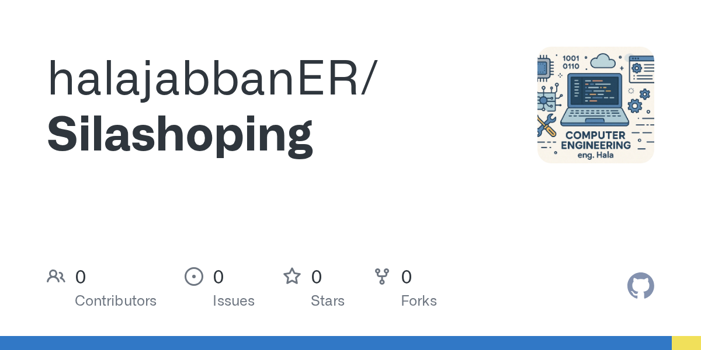
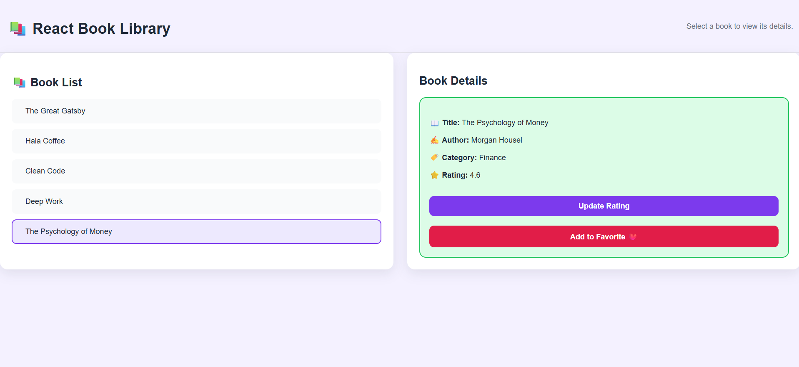
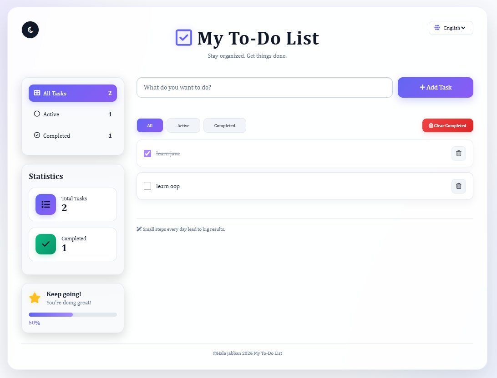
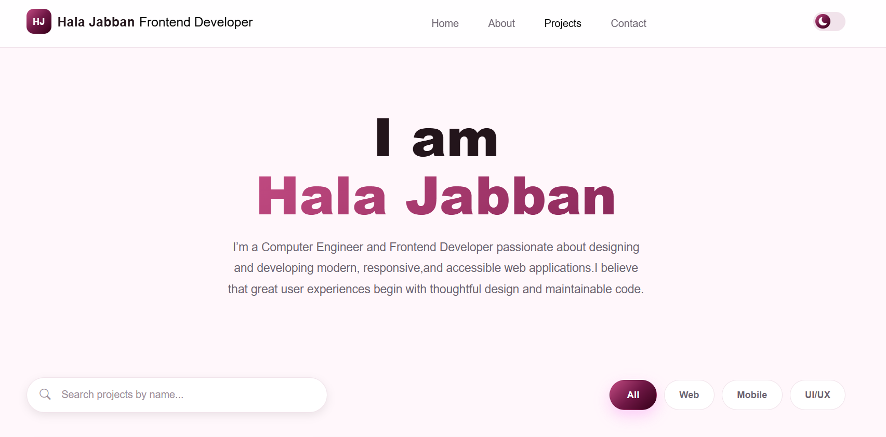
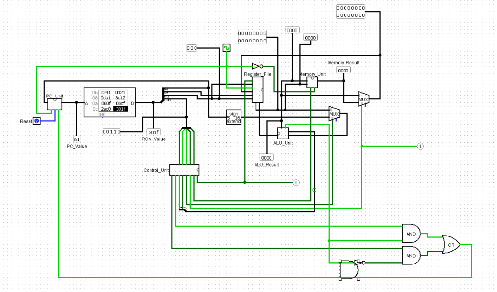
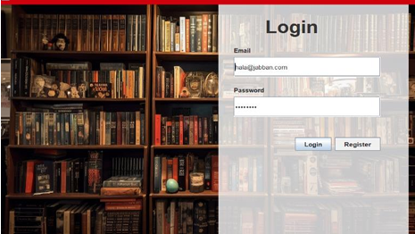

# Hala Jabban Portfolio

A responsive personal portfolio for Hala Jabban, a Computer Engineering student and full-stack web developer based in Istanbul. The site presents professional experience, technical skills, selected projects, and contact information in a modern React interface.

## Project Preview

| Project | Preview |
| --- | --- |
| Tasty Recipes |  |
| Student Management |  |
| Sila Shopping |  |
| React Book Library |  |
| To-Do List |  |
| Portfolio Website |  |
| 16-Bit Processor |  |
| Stock Management |  |

## Features

- Responsive portfolio layout for desktop, tablet, and mobile
- Home, About, Projects, Skills, Journey, and Contact pages
- Client-side routing with React Router
- Light and dark themes with the selected theme saved in local storage
- Searchable and filterable project portfolio
- Project details with technology tags, repository links, and live demos
- Downloadable CV/resume
- Bootstrap layout utilities and Bootstrap Icons

## Tech Stack

- React 19
- Vite
- React Router
- Bootstrap 5
- Bootstrap Icons
- JavaScript (ES modules)
- Oxlint

## Getting Started

### Prerequisites

- Node.js 18 or newer
- npm

### Installation

Clone the repository and install the dependencies:

```bash
git clone https://github.com/halajabbanER/MyProtfolio.git
cd MyProtfolio
npm install
```

### Run locally

From the repository root:

```bash
npm run dev
```

The Vite development server will print the local URL, usually `http://localhost:5173`.

## Available Scripts

Run these commands from the repository root:

| Command | Description |
| --- | --- |
| `npm run dev` | Start the Vite development server |
| `npm run build` | Create a production build in `dist` |
| `npm run lint` | Run Oxlint |
| `npm run preview` | Preview the production build locally |

## Project Structure

```text
frontend/
├── public/
│   ├── data/projects.json       # Project catalogue
│   └── projects/                # Project images
├── src/
│   ├── components/              # Shared navigation, cards, footer, and modal UI
│   ├── pages/                   # Routed portfolio pages
│   ├── App.jsx                  # Routes and theme state
│   ├── App.css                  # Application styles
│   └── translations.js          # Portfolio copy and translations
└── package.json
```

## Updating the Portfolio

- Add or edit projects in `frontend/public/data/projects.json`.
- Place project images in `frontend/public/projects/` and reference them with paths such as `/projects/project-name.png`.
- Update page content and translated copy in `frontend/src/translations.js`.
- Add the resume file at `frontend/public/cv.pdf` to enable the download buttons.

## Routes

- `/` - Home
- `/about` - About and engineering principles
- `/projects` - Project catalogue
- `/skills` - Technical skills and tools
- `/journey` - Experience and education timeline
- `/contact` - Contact form and professional profiles

## Deploying to Vercel

Create a Vercel project with the repository root as the Root Directory. Vercel will use the existing `vercel.json` configuration:

- Build command: `npm run build`
- Output directory: `dist`
- Framework preset: `Vite`

## License

This project is a personal portfolio. Contact the author before reusing its content, branding, or media.

# MyProtfolio